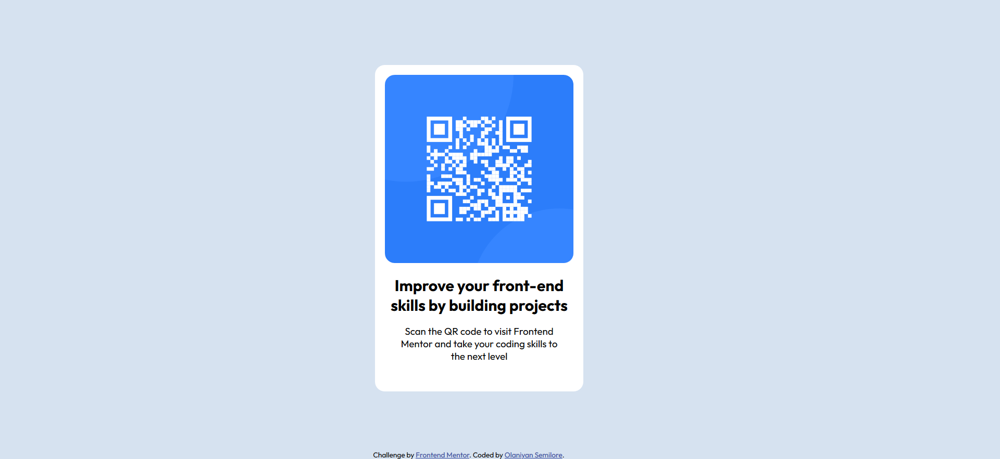

# Frontend Mentor - QR-code-component solution

This is a solution to the [Qr code component challenge on Frontend Mentor](https://www.frontendmentor.io/challenges/qr-code-component-GO7UmttRfa). Frontend Mentor challenges help you improve your coding skills by building realistic projects. 

## Table of contents

- [Overview](#overview)
  - [The challenge](#the-challenge)
  - [Screenshot](#screenshot)
  - [Links](#links)
- [My process](#my-process)
  - [Built with](#built-with)
- [Author](#author)

## Overview

### The challenge

Users should be able to:

- View the optimal layout depending on their device's screen size
- See hover and focus states for interactive elements

### Screenshot

### Links

- Solution URL: (https://github.com/pearlwebdesign/qr-code-component.git)
- Live Site URL: ( https://pearlwebdesign.github.io/qr-code-component/)

## My process

### Built with

- Semantic HTML5 markup
- CSS custom properties
- Flexbox
- CSS Grid

## Author

- Frontend Mentor - [@yourusername](https://www.frontendmentor.io/profile/pearlwebdesign)
- Twitter - [@yourusername](https://www.twitter.com/abeke___)
